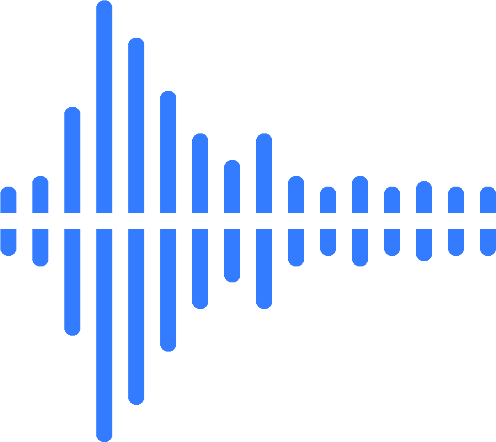
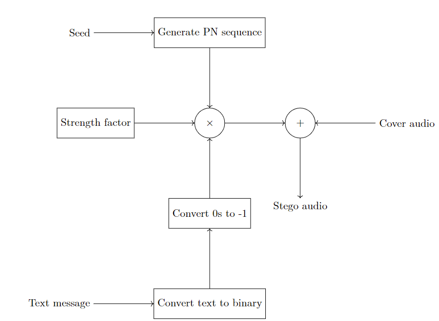
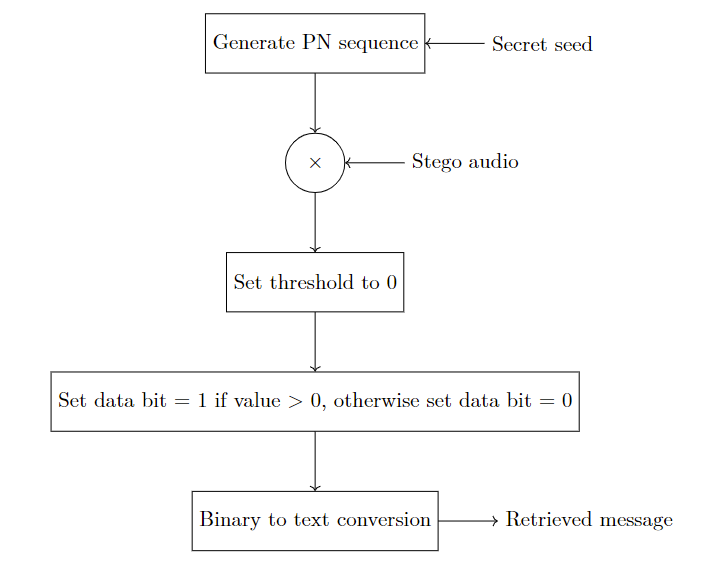
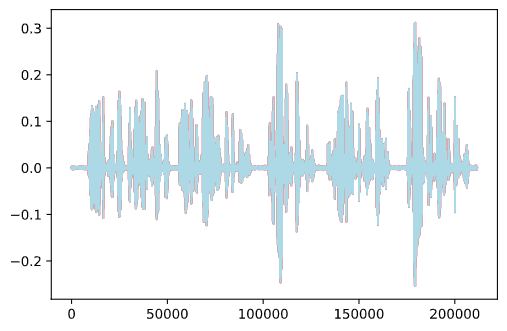

# Steganography in audio using spread spectrum method

<p align="center">
    
</p>

**Description:**

Concealing secret in audio file using spread spectrum method

Detailed report [Here](https://www.overleaf.com/read/jntzjsrnxsgs)

## Technologies Used

- Python
- Numpy

## Details

1. Embedding and Decoding
   |Embed|Decode|
   |---|---|
   |||
2. Results
    |Overlay Original On Sterno | Overlaying Sterno on Original|
    |---|---|
    |||

## Usage

1. Set the parameters in `steganography.py`, including:
   - `SPREADING_FACTOR`
   - `STR_FACTOR_WEIGHT`
2. Run `steganography.py` with parameters

   ```[bash]
    python -m steganography.py <arg1> <arg2> <...>
   
   ```

3. Parameters:

   ```[bash]
    --decrypt -d: whether to instantly decrypt the encrypted file after encryption and check result

    --in-file: name of input file

    --out-file: name of output file
    
    --message: stegano message to blend in the file

    --seed: seed/key use in decryption and encryption 
   ```

## Downside

- It's hard to quantify/measure how effective our sound based approach is in hiding the message cause there is no metric to evaluate audio concealment

## Acknowledgements

- This project was inspired by this [survey](https://www.ripublication.com/ijaer18/ijaerv13n2_40.pdf)
- This project was based on

  ```[text]
    A. A. Krishnan, C. S. Chandran, S. Kamal and M. H. Supriya, "Spread spectrum based encrypted audio steganographic system with improved security," 2017 International Conference on Circuits, Controls, and Communications (CCUBE), 2017, pp. 109-114, doi: 10.1109/CCUBE.2017.8394128.
  ```
